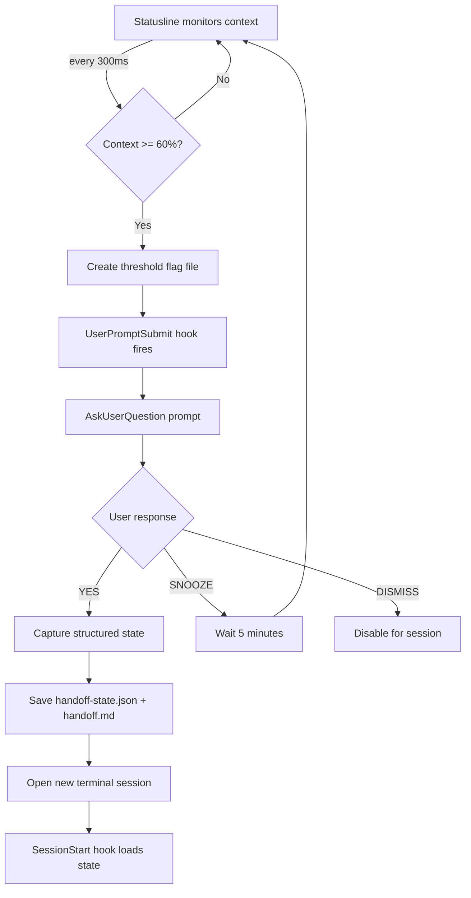

> 🚧 **v1.1.0 IN TESTING** - Native hooks implementation. May have rough edges. Report issues [here](https://github.com/elb-pr/claudikins-automatic-context-manager/issues).

**Automatic context management for Claude Code.** Monitors token usage and triggers at 60% context saturation, prompting for session handoff with an auto-generated summary that opens in a fresh session.

## Requirements

Claude Code CLI and Python 3.

## Why

LLM attention weights distribute across all context tokens. As context fills, per-token attention decreases and earlier information receives less weight during generation.

## What It Does

1. Statusline displays current context percentage
2. At 60% threshold, creates flag file for `UserPromptSubmit` hook
3. Hook injects context prompting Claude to use `AskUserQuestion` for handoff confirmation
4. On confirmation, captures structured state (todos, modified files, git status)
5. Saves state to `.claude/claudikins-acm/handoff-state.json` and human-readable `handoff.md`
6. Opens new terminal session with `claude` command
7. `SessionStart` hook detects and loads structured state into fresh context

## Installation

### Claude Code

1. `/plugin marketplace add elb-pr/claudikins-marketplace`
2. `/plugin` → navigate to Claudikins Marketplace → install

<details>
<summary>Manual</summary>

```bash
git clone https://github.com/elb-pr/claudikins-automatic-context-manager.git
./install.sh
```

</details>

## How It Works



## Configuration

Run `/acm:config` for interactive setup, or edit `~/.claude/claudikins-acm.conf` directly.

| Variable | Default | Range | Description |
|----------|---------|-------|-------------|
| `THRESHOLD` | 60 | 50-90 | Context percentage trigger |
| `SNOOZE_DURATION` | 300 | 60-3600 | Snooze period in seconds |
| `SUMMARY_TOKENS` | 500 | 200-2000 | Max tokens for handoff summary |

## Platform Support

<details>
<summary>Supported terminals and methods</summary>

| Platform | Terminal | New Tab Method |
|----------|----------|----------------|
| Windows native | Windows Terminal | `wt.exe new-tab` (Git Bash or PowerShell) |
| Windows native | Git Bash | New window via `start git-bash` |
| Windows native | PowerShell | New window via `Start-Process` |
| WSL | Windows Terminal | `wt.exe new-tab wsl` |
| WSL | Warp | SendKeys* |
| macOS | iTerm2 | osascript |
| macOS | Terminal.app | osascript (Cmd+T) |
| macOS | Warp | osascript |
| Linux | GNOME Terminal | `--tab` flag |
| Linux | Konsole | `--new-tab` flag |
| Linux | XFCE Terminal | `--tab` flag |
| Linux | Kitty | `@ launch --type=tab` |
| Fallback | Any | Clipboard + instructions |

**\*Warp on WSL**: Uses PowerShell SendKeys automation (focus window, Ctrl+Shift+T, paste, enter). Fragile but functional until Warp adds CLI tab support.

</details>

## Troubleshooting

**Handoff not triggering**
Check context has reached threshold. Snooze may be active, or handoff already triggered this session.

**New terminal not opening**
Platform detection may have failed. Check `platforms/` for your terminal. Falls back to clipboard with instructions.

**Handoff not loading in new session**
Must be in the same project directory. Verify `.claude/claudikins-acm/handoff.md` exists and SessionStart hook is installed.

## Roadmap

- **Semantic triggers** - Detect degradation signals (repetition, errors, stuck loops) rather than relying solely on token thresholds
- **Performance** - Replace regex JSON parsing with jq or Python single-pass extraction
- **Incremental summaries** - Build context summaries progressively rather than only at handoff
- **MCP integration** - Expose handoff status and manual trigger as MCP tools
- **IDE extension** - VS Code integration for non-CLI users

## Uninstall

`/plugin` → Installed → select plugin → Uninstall
