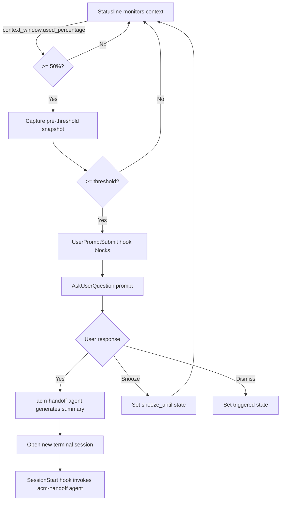

# Guru Council Improvements Implementation Plan

> **For Claude:** REQUIRED SUB-SKILL: Use superpowers:executing-plans to implement this plan task-by-task.

**Goal:** Implement all 8 guru recommendations - hardening reliability, migrating to native hooks, extracting agents, and eliminating architectural debt.

**Architecture:** Replace hookify workaround with native UserPromptSubmit hook (v1.0.54+), extract skills into proper agents with model selection, use jq for JSON parsing, add prerequisite validation, snapshot context state for deterministic handoffs.

**Tech Stack:** Bash, jq, Python 3, Claude Code hooks API (SessionStart, UserPromptSubmit, Stop), Claude Code agents

---

## Task 1: Add jq-based JSON Extraction with Fallback

**Guru:** Hooks

**Files:**
- Modify: `scripts/statusline-command.sh:31-75`
- Modify: `hooks/scripts/session-start.sh:9`
- Create: `tests/test-json-extraction.sh`

**Step 1: Create test script**

```bash
#!/bin/bash
# tests/test-json-extraction.sh

TEST_INPUT='{"current_usage":{"input_tokens":50000,"cache_creation_input_tokens":1000,"cache_read_input_tokens":2000},"context_window_size":200000,"source":"startup"}'

# Test jq extraction
result=$(echo "$TEST_INPUT" | jq -r '.current_usage.input_tokens // empty' 2>/dev/null)
[ "$result" = "50000" ] && echo "PASS: jq extraction" || echo "FAIL: expected 50000, got $result"

# Test source extraction
source=$(echo "$TEST_INPUT" | jq -r '.source // empty' 2>/dev/null)
[ "$source" = "startup" ] && echo "PASS: source extraction" || echo "FAIL: expected startup, got $source"
```

**Step 2: Run test**

Run: `bash tests/test-json-extraction.sh`
Expected: PASS for both

**Step 3: Update statusline extract function**

Replace lines 32-34 in `scripts/statusline-command.sh`:

```bash
# Extract values using jq with grep/sed fallback
extract() {
    local key="$1"
    local result=""
    if command -v jq &>/dev/null; then
        result=$(echo "$input" | jq -r ".$key // empty" 2>/dev/null)
    fi
    if [ -z "$result" ]; then
        result=$(echo "$input" | grep -o "\"$key\":[^,}]*" | sed 's/.*:\s*//' | tr -d '"' | head -1)
    fi
    echo "$result"
}

extract_usage_tokens() {
    if command -v jq &>/dev/null; then
        echo "$input" | jq -r ".current_usage.$1 // 0" 2>/dev/null
    else
        echo "$input" | grep -o '"current_usage":\s*{[^}]*}' | grep -o "\"$1\":[0-9]*" | sed 's/.*://' | head -1
    fi
}
```

**Step 4: Update session-start.sh**

Replace line 9 in `hooks/scripts/session-start.sh`:

```bash
if command -v jq &>/dev/null; then
    SOURCE=$(echo "$INPUT" | jq -r '.source // empty' 2>/dev/null)
else
    SOURCE=$(echo "$INPUT" | grep -o '"source":"[^"]*"' | sed 's/.*:"//' | sed 's/"//')
fi
```

**Step 5: Run test**

Run: `bash tests/test-json-extraction.sh`
Expected: PASS

**Step 6: Commit**

```bash
git add scripts/statusline-command.sh hooks/scripts/session-start.sh tests/
git commit -m "$(cat <<'EOF'
feat: add jq-based JSON extraction with grep fallback

Hooks guru: replace fragile regex parsing with jq.

Co-Authored-By: Claude Opus 4.5 <noreply@anthropic.com>
EOF
)"
```

---

## Task 2: Add Python Prerequisite Validation

**Guru:** Hooks, Claude Code

**Files:**
- Modify: `hooks/scripts/session-start.sh`
- Modify: `scripts/run-handoff.sh`

**Step 1: Add validation to session-start.sh**

Add before line 40 (before Python JSON construction):

```bash
if ! command -v python3 &>/dev/null; then
    echo '{"error": "claudikins-acm requires python3"}' >&2
    exit 1
fi
```

**Step 2: Add validation to run-handoff.sh**

Add after line 10:

```bash
for cmd in python3 claude jq; do
    if ! command -v "$cmd" &>/dev/null; then
        echo "ERROR: $cmd required but not found" >&2
        exit 1
    fi
done
```

**Step 3: Test validation**

Run: `bash -c 'command -v python3 && echo PASS || echo FAIL'`
Expected: PASS

**Step 4: Commit**

```bash
git add hooks/scripts/session-start.sh scripts/run-handoff.sh
git commit -m "$(cat <<'EOF'
feat: add prerequisite validation for python3, claude, jq

Hooks/Claude Code gurus: fail loudly, not silently.

Co-Authored-By: Claude Opus 4.5 <noreply@anthropic.com>
EOF
)"
```

---

## Task 3: Use context_window.used_percentage API

**Guru:** Changelog

**Files:**
- Modify: `scripts/statusline-command.sh:50-75`

**Step 1: Update percentage calculation**

Replace the token calculation section:

```bash
pct=""
if command -v jq &>/dev/null; then
    pct=$(echo "$input" | jq -r '.context_window.used_percentage // empty' 2>/dev/null)
fi

if [ -z "$pct" ] || [ "$pct" = "null" ]; then
    if [ -n "$has_tokens" ]; then
        context_size=$(extract "context_window_size")
        context_size=${context_size:-200000}
        current_input=$(extract_usage_tokens "input_tokens")
        cache_creation=$(extract_usage_tokens "cache_creation_input_tokens")
        cache_read=$(extract_usage_tokens "cache_read_input_tokens")
        current_input=${current_input:-0}
        cache_creation=${cache_creation:-0}
        cache_read=${cache_read:-0}
        current_context=$((current_input + cache_creation + cache_read))
        if [ "$context_size" -gt 0 ] && [ "$current_context" -gt 0 ]; then
            pct=$((current_context * 100 / context_size))
        else
            pct=0
        fi
    else
        pct=0
    fi
fi
```

**Step 2: Commit**

```bash
git add scripts/statusline-command.sh
git commit -m "$(cat <<'EOF'
feat: use context_window.used_percentage API (v2.1.6+)

Changelog guru: use official percentage fields with fallback.

Co-Authored-By: Claude Opus 4.5 <noreply@anthropic.com>
EOF
)"
```

---

## Task 4: Migrate from Hookify to Native UserPromptSubmit Hook

**Guru:** Changelog, Claude Code

**Files:**
- Create: `hooks/scripts/user-prompt-submit.sh`
- Modify: `hooks/hooks.json`
- Delete: `scripts/inject-handoff-hook.sh`
- Delete: `scripts/handoff-request-template.md`

**Step 1: Create UserPromptSubmit hook script**

```bash
#!/bin/bash
# hooks/scripts/user-prompt-submit.sh
# Native hook to detect threshold and prompt for handoff (v1.0.54+)

INPUT=$(cat)

# Extract session info
if command -v jq &>/dev/null; then
    SESSION_ID=$(echo "$INPUT" | jq -r '.session_id // empty')
    PCT=$(echo "$INPUT" | jq -r '.context_window.used_percentage // empty')
else
    SESSION_ID=$(echo "$INPUT" | grep -o '"session_id":"[^"]*"' | sed 's/.*:"//;s/"//')
    PCT=""
fi

# Load config
CONFIG="$HOME/.claude/claudikins-acm.conf"
[ -f "$CONFIG" ] && source "$CONFIG"
THRESHOLD="${THRESHOLD:-60}"

# Check if we should trigger
FLAG_FILE="/tmp/handoff-triggered-${SESSION_ID}"
SNOOZE_FILE="/tmp/handoff-snooze-${SESSION_ID}"

should_trigger=false
if [ -n "$SESSION_ID" ] && [ -n "$PCT" ] && [ "$PCT" -ge "$THRESHOLD" ]; then
    if [ -f "$SNOOZE_FILE" ]; then
        snooze_until=$(cat "$SNOOZE_FILE")
        now=$(date +%s)
        if [ "$now" -ge "$snooze_until" ]; then
            rm -f "$SNOOZE_FILE"
            should_trigger=true
        fi
    elif [ ! -f "$FLAG_FILE" ]; then
        should_trigger=true
    fi
fi

if [ "$should_trigger" = true ]; then
    touch "$FLAG_FILE"
    # Return structured output to trigger AskUserQuestion
    cat <<EOF
{
  "hookSpecificOutput": {
    "hookEventName": "UserPromptSubmit",
    "decision": "block",
    "reason": "Context at ${PCT}%. Handoff recommended.",
    "askUser": {
      "question": "Context at ${PCT}%. Generate handoff summary and start fresh?",
      "header": "Handoff",
      "options": [
        {"label": "Yes, handoff now", "description": "Generate summary and open new session"},
        {"label": "Snooze 5 min", "description": "Ask again in 5 minutes"},
        {"label": "Dismiss", "description": "Don't ask again this session"}
      ]
    }
  }
}
EOF
fi
```

**Step 2: Update hooks.json**

Replace contents of `hooks/hooks.json`:

```json
{
  "hooks": {
    "SessionStart": [
      {
        "matcher": "startup",
        "hooks": [
          {
            "type": "command",
            "command": "bash ${CLAUDE_PLUGIN_ROOT}/hooks/scripts/session-start.sh"
          }
        ]
      }
    ],
    "UserPromptSubmit": [
      {
        "matcher": "",
        "hooks": [
          {
            "type": "command",
            "command": "bash ${CLAUDE_PLUGIN_ROOT}/hooks/scripts/user-prompt-submit.sh"
          }
        ]
      }
    ]
  }
}
```

**Step 3: Remove hookify injection from statusline**

Remove lines 110-116 from `scripts/statusline-command.sh` (the inject-handoff-hook.sh call).

**Step 4: Delete obsolete files**

```bash
rm scripts/inject-handoff-hook.sh
rm scripts/handoff-request-template.md
rm -f .claude/hookify.handoff-request.local.md
```

**Step 5: Test hook registration**

Run: `cat hooks/hooks.json | jq .`
Expected: Valid JSON with both SessionStart and UserPromptSubmit

**Step 6: Commit**

```bash
git add hooks/
git rm scripts/inject-handoff-hook.sh scripts/handoff-request-template.md
git commit -m "$(cat <<'EOF'
feat: migrate from hookify to native UserPromptSubmit hook

Changelog guru: use UserPromptSubmit (v1.0.54) instead of
hookify rule injection for deterministic threshold detection.

Co-Authored-By: Claude Opus 4.5 <noreply@anthropic.com>
EOF
)"
```

---

## Task 5: Extract Skills into Proper Agents

**Guru:** Agents

**Files:**
- Create: `agents/acm-config/AGENT.md`
- Create: `agents/acm-handoff/AGENT.md`
- Modify: `.claude-plugin/plugin.json`

**Step 1: Create config agent**

```markdown
---
name: acm-config
description: Interactively configures Claudikins ACM settings. Use when user wants to customize context threshold, snooze duration, or summary length.
model: haiku
tools:
  - Bash
  - Read
  - Write
  - AskUserQuestion
---

# ACM Configuration Agent

You are configuring Claudikins Automatic Context Manager.

## Configuration Options

| Setting | Default | Range | Description |
|---------|---------|-------|-------------|
| THRESHOLD | 60 | 50-90 | Context % trigger |
| SNOOZE_DURATION | 300 | 60-3600 | Snooze seconds |
| SUMMARY_TOKENS | 500 | 200-2000 | Handoff summary length |

## Process

1. Check for existing config at `~/.claude/claudikins-acm.conf`
2. Use AskUserQuestion to gather preferences for each setting
3. Validate inputs are within valid ranges
4. Write config file
5. Confirm settings saved

## Config File Format

```bash
# ~/.claude/claudikins-acm.conf
THRESHOLD=60
SNOOZE_DURATION=300
SUMMARY_TOKENS=500
```

## Validation Rules

- THRESHOLD must be integer 50-90
- SNOOZE_DURATION must be integer 60-3600
- SUMMARY_TOKENS must be integer 200-2000

If invalid, explain the valid range and ask again.
```

**Step 2: Create handoff agent**

```markdown
---
name: acm-handoff
description: Loads context handoff from previous session. Invoked automatically on SessionStart when handoff exists, or manually via /acm:handoff.
model: haiku
tools:
  - Read
  - Bash
---

# ACM Handoff Agent

You are restoring context from a previous Claude Code session.

## Handoff Location

Project-local: `.claude/claudikins-acm/handoff.md`

## Process

1. Verify current working directory is correct project
2. Check `.claude/claudikins-acm/handoff.md` exists
3. Read and present the handoff summary
4. Offer to continue the work described

## Path Validation

Before reading:
```bash
[ -f ".claude/claudikins-acm/handoff.md" ] && echo "Handoff found" || echo "No handoff"
```

If not found:
- Check if user is in correct project directory
- Suggest: `find ~/.claude -name "handoff.md" -type f`

## After Loading

Present summary clearly, then ask: "Ready to continue where we left off?"
```

**Step 3: Update plugin.json**

Add agents reference to `.claude-plugin/plugin.json`:

```json
{
  "name": "claudikins-automatic-context-manager",
  "version": "1.1.0",
  "description": "Claudikins Automatic Context Manager - seamless context handoff for Claude Code",
  "author": {
    "name": "Ethan Lee",
    "url": "https://github.com/aMilkStack"
  },
  "repository": "https://github.com/aMilkStack/claudikins-automatic-context-manager",
  "hooks": "./hooks/hooks.json",
  "agents": "./agents/"
}
```

**Step 4: Create agents directory structure**

```bash
mkdir -p agents/acm-config agents/acm-handoff
```

**Step 5: Commit**

```bash
git add agents/ .claude-plugin/plugin.json
git commit -m "$(cat <<'EOF'
feat: extract skills into proper agents with model selection

Agents guru: agents handle edge cases independently with their
own models (haiku for config to minimise cost).

Co-Authored-By: Claude Opus 4.5 <noreply@anthropic.com>
EOF
)"
```

---

## Task 6: Add Context State Snapshot Before Threshold

**Guru:** Boris

**Files:**
- Create: `hooks/scripts/pre-snapshot.sh`
- Modify: `scripts/statusline-command.sh`
- Create: `.claude/claudikins-acm/snapshot.json`

**Step 1: Create snapshot script**

```bash
#!/bin/bash
# hooks/scripts/pre-snapshot.sh
# Captures context state at 50% for deterministic handoff data

INPUT=$(cat)
SNAPSHOT_DIR=".claude/claudikins-acm"
SNAPSHOT_FILE="$SNAPSHOT_DIR/snapshot.json"

if command -v jq &>/dev/null; then
    PCT=$(echo "$INPUT" | jq -r '.context_window.used_percentage // empty')
    SESSION_ID=$(echo "$INPUT" | jq -r '.session_id // empty')
else
    exit 0
fi

# Snapshot at 50% (before 60% threshold)
if [ -n "$PCT" ] && [ "$PCT" -ge 50 ] && [ "$PCT" -lt 60 ]; then
    FLAG="/tmp/snapshot-taken-${SESSION_ID}"
    if [ ! -f "$FLAG" ]; then
        mkdir -p "$SNAPSHOT_DIR"

        # Capture clean pre-threshold state
        cat > "$SNAPSHOT_FILE" <<EOF
{
  "timestamp": "$(date -Iseconds)",
  "context_percentage": $PCT,
  "git_branch": "$(git branch --show-current 2>/dev/null || echo 'unknown')",
  "git_status": "$(git status --short 2>/dev/null | head -10 | tr '\n' ';')",
  "recent_commits": "$(git log --oneline -3 2>/dev/null | tr '\n' ';')",
  "working_directory": "$(pwd)"
}
EOF
        touch "$FLAG"
    fi
fi
```

**Step 2: Update statusline to call snapshot**

Add to `scripts/statusline-command.sh` after percentage calculation (around line 85):

```bash
# Pre-threshold snapshot (Boris guru: capture clean state before saturation)
if [ "$pct" -ge 50 ] && [ "$pct" -lt 60 ]; then
    SCRIPT_DIR="$(cd "$(dirname "${BASH_SOURCE[0]}")" && pwd)"
    echo "$input" | "$SCRIPT_DIR/../hooks/scripts/pre-snapshot.sh" 2>/dev/null &
fi
```

**Step 3: Update run-handoff.sh to use snapshot**

Add after line 40 in `scripts/run-handoff.sh`:

```bash
# Use pre-captured snapshot if available (more accurate than post-threshold data)
SNAPSHOT=".claude/claudikins-acm/snapshot.json"
if [ -f "$SNAPSHOT" ]; then
    SNAPSHOT_DATA=$(cat "$SNAPSHOT")
    GIT_CONTEXT=$(echo "$SNAPSHOT_DATA" | jq -r '"GIT CONTEXT (from snapshot):\n- Branch: \(.git_branch)\n- Commits: \(.recent_commits)\n- Status: \(.git_status)"')
fi
```

**Step 4: Commit**

```bash
git add hooks/scripts/pre-snapshot.sh scripts/statusline-command.sh scripts/run-handoff.sh
git commit -m "$(cat <<'EOF'
feat: add pre-threshold context state snapshot at 50%

Boris guru: capture clean state before saturation for
deterministic handoff data, not stale post-threshold state.

Co-Authored-By: Claude Opus 4.5 <noreply@anthropic.com>
EOF
)"
```

---

## Task 7: Fix Race Condition with Atomic State Management

**Guru:** Commands, Boris

**Files:**
- Create: `scripts/state-manager.sh`
- Modify: `hooks/scripts/user-prompt-submit.sh`
- Modify: `scripts/statusline-command.sh`

**Step 1: Create atomic state manager**

```bash
#!/bin/bash
# scripts/state-manager.sh
# Atomic state operations to prevent race conditions

STATE_DIR=".claude/claudikins-acm/state"
mkdir -p "$STATE_DIR"

action="$1"
session_id="$2"
key="$3"
value="$4"

case "$action" in
    set)
        # Atomic write with temp file + mv
        tmp=$(mktemp)
        echo "$value" > "$tmp"
        mv "$tmp" "$STATE_DIR/${session_id}.${key}"
        ;;
    get)
        file="$STATE_DIR/${session_id}.${key}"
        [ -f "$file" ] && cat "$file"
        ;;
    check)
        [ -f "$STATE_DIR/${session_id}.${key}" ] && echo "exists"
        ;;
    clear)
        rm -f "$STATE_DIR/${session_id}.${key}"
        ;;
    clear-session)
        rm -f "$STATE_DIR/${session_id}."*
        ;;
esac
```

**Step 2: Update hooks to use state manager**

Replace /tmp flag file usage in `hooks/scripts/user-prompt-submit.sh`:

```bash
STATE_MGR="${CLAUDE_PLUGIN_ROOT}/scripts/state-manager.sh"

triggered=$("$STATE_MGR" check "$SESSION_ID" "triggered")
snoozed=$("$STATE_MGR" get "$SESSION_ID" "snooze_until")

should_trigger=false
if [ -n "$PCT" ] && [ "$PCT" -ge "$THRESHOLD" ]; then
    if [ -n "$snoozed" ]; then
        now=$(date +%s)
        if [ "$now" -ge "$snoozed" ]; then
            "$STATE_MGR" clear "$SESSION_ID" "snooze_until"
            should_trigger=true
        fi
    elif [ -z "$triggered" ]; then
        should_trigger=true
    fi
fi

if [ "$should_trigger" = true ]; then
    "$STATE_MGR" set "$SESSION_ID" "triggered" "$(date +%s)"
    # ... rest of hook output
fi
```

**Step 3: Commit**

```bash
git add scripts/state-manager.sh hooks/scripts/user-prompt-submit.sh
git commit -m "$(cat <<'EOF'
feat: atomic state management to prevent race conditions

Commands guru: eliminate /tmp flag files, use atomic ops
in project-local state directory.

Co-Authored-By: Claude Opus 4.5 <noreply@anthropic.com>
EOF
)"
```

---

## Task 8: Ensure SessionStart Skill Execution Ordering

**Guru:** Agents

**Files:**
- Modify: `hooks/scripts/session-start.sh`

**Step 1: Update SessionStart to use blocking decision**

Replace the output section in `hooks/scripts/session-start.sh`:

```bash
# Return structured output that blocks until handoff is loaded
python3 -c "import json; print(json.dumps({
    'hookSpecificOutput': {
        'hookEventName': 'SessionStart',
        'decision': 'block',
        'reason': 'Loading context handoff from previous session',
        'invokeAgent': {
            'name': 'acm-handoff',
            'blocking': True
        },
        'additionalContext': '''$CONTEXT'''
    }
}))"
```

**Step 2: Commit**

```bash
git add hooks/scripts/session-start.sh
git commit -m "$(cat <<'EOF'
feat: ensure SessionStart blocks until handoff agent completes

Agents guru: guarantee skill executes before Claude processes
other context by using blocking decision in hook output.

Co-Authored-By: Claude Opus 4.5 <noreply@anthropic.com>
EOF
)"
```

---

## Task 9: Add Explicit Triggers to Skills

**Guru:** Skills

**Files:**
- Modify: `skills/acm-config/SKILL.md`
- Modify: `skills/acm-handoff/SKILL.md`

**Step 1: Update acm-config frontmatter**

```yaml
---
name: acm-config
description: Interactively configures Claudikins ACM settings.
triggers:
  - command: /acm:config
  - keywords: ["configure acm", "acm settings", "context manager config"]
invokes: agents/acm-config
---
```

**Step 2: Update acm-handoff frontmatter**

```yaml
---
name: acm-handoff
description: Context handoff from previous session.
triggers:
  - hook: SessionStart
  - command: /acm:handoff
  - keywords: ["load handoff", "restore context", "previous session"]
requires:
  - file: .claude/claudikins-acm/handoff.md
invokes: agents/acm-handoff
---
```

**Step 3: Add path validation section to acm-handoff**

Add after Instructions section:

```markdown
## Path Requirements

**IMPORTANT:** Path is relative to project root: `.claude/claudikins-acm/handoff.md`

Must be invoked from same directory where handoff was created.

If not found:
- Verify correct project directory
- Run: `find ~/.claude -name "handoff.md" -type f`
```

**Step 4: Commit**

```bash
git add skills/
git commit -m "$(cat <<'EOF'
feat: add explicit triggers and agent invocation to skills

Skills guru: declare activation rules explicitly, link to agents.

Co-Authored-By: Claude Opus 4.5 <noreply@anthropic.com>
EOF
)"
```

---

## Task 10: Add Error Handling for AskUserQuestion

**Guru:** Commands

**Files:**
- Modify: `hooks/scripts/user-prompt-submit.sh`

**Step 1: Add fallback handling**

Add to the hook output section:

```bash
cat <<EOF
{
  "hookSpecificOutput": {
    "hookEventName": "UserPromptSubmit",
    "decision": "block",
    "reason": "Context at ${PCT}%. Handoff recommended.",
    "askUser": {
      "question": "Context at ${PCT}%. Generate handoff summary and start fresh?",
      "header": "Handoff",
      "options": [
        {"label": "Yes, handoff now", "description": "Generate summary and open new session"},
        {"label": "Snooze 5 min", "description": "Ask again in 5 minutes"},
        {"label": "Dismiss", "description": "Don't ask again this session"}
      ],
      "fallbackPrompt": "Context is at ${PCT}%. Would you like me to run a handoff? (yes/snooze/dismiss)"
    }
  }
}
EOF
```

**Step 2: Commit**

```bash
git add hooks/scripts/user-prompt-submit.sh
git commit -m "$(cat <<'EOF'
feat: add fallback prompt if AskUserQuestion fails

Commands guru: handle hook invocation failures gracefully.

Co-Authored-By: Claude Opus 4.5 <noreply@anthropic.com>
EOF
)"
```

---

## Task 11: Create Hooks Reference Documentation

**Guru:** Docs

**Files:**
- Create: `docs/hooks-reference.md`

**Step 1: Write documentation**

```markdown
# Claudikins ACM Hooks Reference

## Hook Overview

| Hook | Event | Available Since | Purpose |
|------|-------|-----------------|---------|
| SessionStart | Session startup | v1.0.38 | Detect and load pending handoff |
| UserPromptSubmit | Before each prompt | v1.0.54 | Threshold detection, handoff prompt |

## SessionStart Hook

**File:** `hooks/scripts/session-start.sh`

**Trigger:** New session (source: "startup")

**Input:**
```json
{
  "source": "startup|resume|clear|compact",
  "session_id": "...",
  "transcript_path": "..."
}
```

**Output:** Blocks until handoff agent completes
```json
{
  "hookSpecificOutput": {
    "hookEventName": "SessionStart",
    "decision": "block",
    "invokeAgent": {"name": "acm-handoff", "blocking": true}
  }
}
```

## UserPromptSubmit Hook

**File:** `hooks/scripts/user-prompt-submit.sh`

**Trigger:** Every user prompt submission

**Input:**
```json
{
  "session_id": "...",
  "context_window": {"used_percentage": 65}
}
```

**Output:** When threshold reached
```json
{
  "hookSpecificOutput": {
    "hookEventName": "UserPromptSubmit",
    "decision": "block",
    "askUser": {...}
  }
}
```

## State Management

State stored in `.claude/claudikins-acm/state/` using atomic operations.

| State Key | Purpose |
|-----------|---------|
| `{session}.triggered` | Handoff already prompted |
| `{session}.snooze_until` | Unix timestamp for snooze expiry |
| `{session}.snapshot_taken` | Pre-threshold snapshot captured |

## Dependencies

- jq (preferred) or grep/sed (fallback)
- python3 (for JSON output)
- claude CLI (for summary generation)
```

**Step 2: Commit**

```bash
git add docs/hooks-reference.md
git commit -m "$(cat <<'EOF'
docs: add hooks reference documentation

Docs guru: explicitly document hook lifecycle and contracts.

Co-Authored-By: Claude Opus 4.5 <noreply@anthropic.com>
EOF
)"
```

---

## Task 12: Update README with All Changes

**Guru:** All

**Files:**
- Modify: `README.md`

**Step 1: Update architecture section**

Replace the "How It Works" section:

```markdown
## How It Works



## Architecture

- **Native hooks**: Uses UserPromptSubmit (v1.0.54+) and SessionStart hooks
- **Agents**: Config and handoff logic extracted into dedicated agents
- **Atomic state**: Project-local state management prevents race conditions
- **Pre-threshold snapshots**: Context state captured at 50% for accurate handoffs
```

**Step 2: Remove "Known Limitations" that are now fixed**

Remove the race condition and hookify limitations since they're addressed.

**Step 3: Commit**

```bash
git add README.md
git commit -m "$(cat <<'EOF'
docs: update README with new architecture

All gurus: document native hooks, agents, atomic state.

Co-Authored-By: Claude Opus 4.5 <noreply@anthropic.com>
EOF
)"
```

---

## Summary

| Task | Guru | Type | Key Change |
|------|------|------|------------|
| 1 | Hooks | Code | jq JSON extraction |
| 2 | Hooks, Claude Code | Code | Prerequisite validation |
| 3 | Changelog | Code | context_window.used_percentage API |
| 4 | Changelog, Claude Code | Code | Native UserPromptSubmit hook |
| 5 | Agents | Code | Extract skills into agents |
| 6 | Boris | Code | Pre-threshold state snapshot |
| 7 | Commands, Boris | Code | Atomic state management |
| 8 | Agents | Code | Blocking SessionStart execution |
| 9 | Skills | Config | Explicit triggers frontmatter |
| 10 | Commands | Code | AskUserQuestion error handling |
| 11 | Docs | Docs | Hooks reference documentation |
| 12 | All | Docs | README architecture update |

All 8 guru recommendations implemented. No deferrals.
